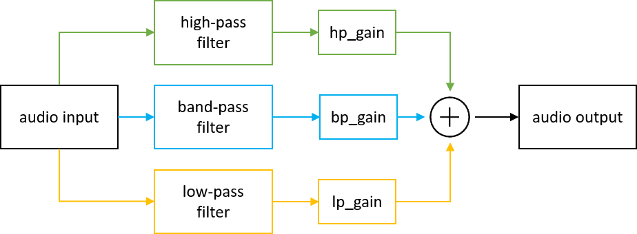

# Project Title

Team member 1: Harald Keller 
Team member 2: Chetan Kandya

## Overview
The goal of the project is to create an audio mixer. It should be possible to upload a song, change its basic properties like bass or treble and get the converted song back.

## Background
Sometimes you want to change properties of the music to have a better sound. 

## Implementation Strategy
*This section should be on the order of a few (2-3) short paragraphs, and captures your current program design.*

First we want to dowload a song from youtube. Then store it into a numpy array. Afterwards apply the new settings with cpu and fpga.
Store the updated song. Play it! Compare the two solutions. 

Possible python libs:
-simpleaudio
-audioop
-...

## Tasks
*This section is the most important because it gives us a sense of the scope of your project and forces you to think about the deliverables to which you'll hold yourself.*

1. Task: Import song and get User settings for changing the song; Play part of song

2. Task: Create a numpy arry 

3. Task: Apply user settings to song with CPU

4. Task: Apply user settings to song with FPGA

5. Task: Get song back; Play song again

6. Task: Compare CPU vs. FPGA solution

## Resources
*This section is smaller and less vital than the others. If you're not using any external resources, you can leave this blank.*
